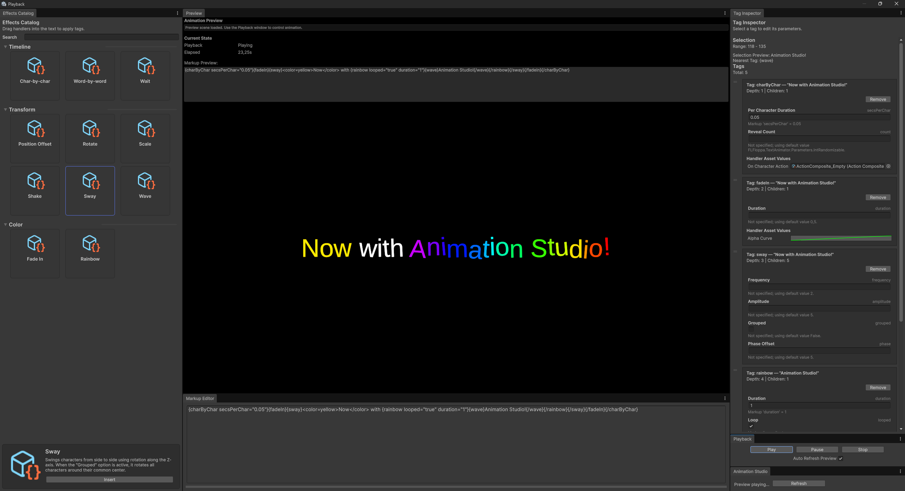

<div align="center">

# FLFloppa Text Animator

_Tag-driven, editor-first character animation pipeline for Unity 2022.3+_

[](#requirements)
[](#license)
[](#support--questions)

Want to make your dialogue shimmer, bounce, and react without hand-animating every character? FLFloppa Text Animator lets you describe motion with friendly `{wave}` or `{rainbow}` tags, then handles the heavy lifting with a modular, zero-allocation runtime. Prefer building bespoke behaviours? Extend the pipeline with your own handlers, applicators, and subsystems tailored to any text component—even custom ones.


</div>

---

## Table of contents

* [Highlights](#highlights)
* [Requirements](#requirements)
* [Installation](#installation)
* [Quick start](#quick-start)
* [Built-in tags](#built-in-tags)
* [Create your own magic](#create-your-own-magic)
* [Editor setup](#editor-setup)
* [Architecture overview](#architecture-overview)
* [Editor tooling](#editor-tooling)
* [Samples](#samples)
* [Animation Studio](#animation-studio)
* [Documentation](#documentation)
* [Roadmap](#roadmap)
* [Contributing](#contributing)
* [Support & questions](#support--questions)
* [License](#license)

---

## Highlights

* __Drop-in markup animation__ – Type `{scale speed=fast}` or `{wave amplitude=wave_amp}` into your text and watch characters come alive instantly.
* __Reusable parameters__ – Store numeric ranges, booleans, and gradients in parameter assets you can drag onto any handler.
* __Pipeline building blocks__ – Mix and match Transform, Color, and Material subsystems, or craft new ones for custom text renderers.
* __Editor-first authoring__ – UI Toolkit inspectors summarise aliases, curve stats, gradients, and parameter assignments with undo-aware tracking.
* __Runtime without spikes__ – Modifier chains are cached and reused so play mode stays smooth even when timelines get complex.

---

## Requirements

* Unity **2022.3 LTS** or newer.
* TextMesh Pro (included with Unity; ensure it is imported in your project).
* [FLFloppa Editor Helpers](https://github.com/FLFloppa/editor-helpers.git) – provides shared inspector components used throughout the package.

---

## Installation

### Via Git URL (recommended)

1. Open **Window → Package Manager**.
2. Click the **+** button → **Add package from git URL…**
3. Paste the repository URL and optional release tag:
   ```text
   https://github.com/FLFloppa/text-animator.git#v0.2.0
   ```
4. Unity installs the package and exposes its samples.
5. **Install FLFloppa Editor Helpers** via Git URL as well:
   ```text
   https://github.com/FLFloppa/editor-helpers.git
   ```

### Via GitHub release archive

1. Download the latest release archive from [GitHub](https://github.com/FLFloppa/text-animator/releases).
2. Extract `Packages/FLFloppa Text Animator/` into your project `Packages/` directory.
3. Reopen Unity to import assembly definitions.
4. Add FLFloppa Editor Helpers by repeating the extraction for `Packages/FLFloppa Editor Helpers/` or installing via Git URL.

### Manual clone

1. Clone the repository locally.
2. Add an **embedded package**: copy `Packages/FLFloppa Text Animator/` into your Unity project `Packages/` folder.
3. Clone `https://github.com/FLFloppa/editor-helpers.git` and embed `Packages/FLFloppa Editor Helpers/` next to the text animator folder.

> **Dependencies:** The text animator does not auto-install FLFloppa Editor Helpers. Bring it in manually so the inspectors render correctly.

---

## Quick start

1. **Create assets** via the Project window:
   * `FLFloppa/Text Animator/Handlers/Rotate Tag Handler`
   * `FLFloppa/Text Animator/Parameters/Float Parameter` (e.g., `duration`)
   * `FLFloppa/Text Animator/Parser/Curly Brace`
   * `FLFloppa/Text Animator/Subsystems/Transform/Color/Material`
2. **Assemble a registry** – Create a `TagHandlerRegistryAsset`, add handlers, and list aliases like `{rotate}` or `{sway}`.
3. **Drop a TextAnimator component** onto a `TMP_Text` object; assign the registry, parser asset, and subsystem bundle or individual subsystem assets.
4. **Enter markup** in `Initial Markup` or call:
   ```csharp
   textAnimator.Play("{wave amplitude=wave_amp}{rainbow gradient=title_colors}Hello!{/rainbow}{/wave}");
   ```
5. **Preview animation** by entering Play Mode; tweak curves and parameters live via the inspectors.

For a preconfigured scene, import the **Basic Text Animator Setup** sample from the Package Manager (see [Samples](#samples)).

---

## Built-in tags

| Tag | Category | Description | Common Parameters |
| --- | --- | --- | --- |
| `{scale}` | Transform | Applies independent X/Y/Z scale curves. | `duration`, `loop`, `scaleX`, `scaleY`, `scaleZ` |
| `{rotate}` | Transform | Drives rotation angle directly from an animation curve. | `duration`, `loop`, `rotationCurve` |
| `{positionoffset}` | Transform | Offsets characters using per-axis curves. | `duration`, `loop`, `override`, `positionX`, `positionY`, `positionZ` |
| `{sway}` | Transform | Sinusoidal sway with optional grouped pivot. | `frequency`, `amplitude`, `phaseOffset`, `grouped` |
| `{shake}` | Transform | Randomised jitter effect. | `amplitude`, `frequency`, `synchronize` |
| `{wave}` | Transform | Wave motion with amplitude/frequency/phase control. | `amplitude`, `frequency`, `phase` |
| `{fadein}` | Color | Alpha blend driven by an animation curve. | `duration`, `alphaCurve` |
| `{rainbow}` | Color | Gradient-based colour cycling. | `duration`, `loop`, `colorShift`, `gradient` |
| `{wait}` | Timeline | Pauses the timeline for the supplied duration. | `duration` |
| `{charbychar}` | Timeline | Reveals characters in batches, optionally invoking actions. | `perCharacterDuration`, `revealCount`, `onCharacterAction` |
| `{wordbyword}` | Timeline | Reveals words in groups with optional callbacks. | `perWordDuration`, `wordsPerBatch`, `onWordAction` |
| `{action}` | Timeline | Executes a scripted `ActionAsset`. | `action` |

A comprehensive parameter matrix is available in [`Docs/tag_reference.md`](Docs/tag_reference.md).


---

## Create your own magic

* __Want brand-new tags?__ Derive from `TagHandlerAsset`, expose parameters as serialized fields, and implement the runtime handler to apply custom modifiers.
* __Need extra animation channels?__ Add new pipeline segments by extending `TextAnimatorSubsystemAsset` and authoring applicators that push data into your target renderer.
* __Animating properties we don’t ship?__ Create a `TextOutputApplicatorAsset<TOutput, TState>` that writes into any property—shader keywords, rich text materials, bespoke mesh data, you name it.
* __Targeting custom text components?__ Implement your own subsystem + applicator pair, then bind it inside the `TextAnimatorSubsystemBundleAsset`.

---

## Architecture overview

* __Runtime/Animator__ – `TextAnimator` MonoBehaviour, subsystem interfaces, and playback pipeline builders.
* __Runtime/Tags__ – Handler assets, runtime modifiers, and reusable action system.
* __Runtime/Parameters__ – Culture-invariant parsing and validation of markup attributes.
* __Runtime/Effects__ – Character state modifiers (scale, rotate, sway, shake, rainbow, etc.).
* __Editor__ – UI Toolkit inspectors, shared inspector base classes, and authoring utilities built on FLFloppa Editor Helpers.

The runtime builds a `PlaybackTimeline` from parsed tags, feeds modifiers into subsystem-specific pipelines, and applies results through text output applicators (TextMeshPro by default).

---

## Editor tooling

* __Tag handler inspectors__ – Live alias counts, curve statistics, parameter slot summaries, gradient previews.
* __Parameter inspectors__ – Identifier lists, default value previews, range validation, randomization toggles.
* __Subsystem inspectors__ – Report configured applicators and subsystem keys; highlight missing dependencies.
* __Applicator inspectors__ – Document target subsystem/output type with quick reference descriptions.
* __Shared infrastructure__ – `ScriptableObjectInspectorBase` keeps undo/redo callbacks and property tracking consistent across all assets.

All inspectors leverage FLFloppa Editor Helpers for consistent styling, cards, and summary labels.

---

## Samples

Import the **Basic Text Animator Setup** sample (`Samples~/BasicSetup/`) to explore:

* Preconfigured tag handlers, parameter assets, and subsystem bundle.
* A `TextAnimator` scene showcasing looping markup and runtime API usage.
* Inspector walkthrough notes demonstrating best practices.

---

## Animation Studio

The Animation Studio is a multi-window authoring environment built on UI Toolkit that speeds up tag composition, handler browsing, and live preview workflows.



### Key capabilities

* __Tag-aware markup editor__ – syntax-highlighting text window with inline selection syncing and undo-safe tag injection.
* __Effects catalog__ – grouped tag cards with drag-and-drop support, search-as-you-type filtering, and detailed handler summaries.
* __Tag inspector__ – reorderable card stack bound to the current selection with inline parameter editing and handler asset field inspection.
* __Live preview pipeline__ – dedicated preview scene that mirrors playback state, supporting pause/scrub and auto-refresh loops.

### Getting started

1. Launch the studio via `Window → FLFloppa → Text Animator → Animation Studio`.
2. Load or paste markup into the Markup window, then select text to reveal matching tag cards.
3. Drag new effects from the catalog or edit parameters directly in the inspector; changes propagate back to markup instantly.
4. Press **Play** inside the Playback panel to validate timing, loop behaviour, and handler stacking.

For a full walkthrough—including workspace layout, workflow tips, and troubleshooting—see the dedicated [Animation Studio Manual](Docs/animation_studio_manual.md).

---

## Editor setup

For a step-by-step authoring tutorial covering parameter assets, tag handlers, action assets, registries, subsystems, and the `TextAnimator` component, see the dedicated [Editor Setup Guide](Docs/editor_setup.md).

---

## Documentation

* [`Docs~/design.md`](Docs/design.md) – Architecture deep dive and design principles.
* [`Docs/tag_reference.md`](Docs/tag_reference.md) – Comprehensive tag and parameter reference (authorable data).
* [`Docs~/use-case-1.md`](Docs/use-case-1.md) – Narrative dialogue animation walkthrough.
* [`Docs~/use-case-2.md`](Docs/use-case-2.md) – HUD notifications and rapid feedback effects.
* [`Docs~/use-case-3.md`](Docs/use-case-3.md) – Combining actions with timeline events.
* [`Docs/animation_studio_manual.md`](Docs/animation_studio_manual.md) – Workspace guide for catalog browsing, inspector workflows, and preview operations.
* [`Docs/CHANGELOG.md`](Docs/CHANGELOG.md) – Release notes (to be generated for GitHub release).

Unity Package Manager links the `documentationUrl` and `changelogUrl` metadata to these files once hosted on GitHub.

---

## Roadmap

* Additional built-in tags (typewriter, bounce, blur, material swapping).
* Visual timeline preview window and live text capture.
* Alternative outputs (UI Toolkit `TextElement`, Sprite-based fonts).
* Extended sample library with animated dialogue UI templates.

Track progress via [`Docs/CHANGELOG.md`](Docs/CHANGELOG.md) and upcoming GitHub project boards.

---

## Contributing

Contributions are welcome! Please open issues or pull requests once the repository is public. Follow standard Unity C# guidelines and ensure new features include documentation and samples where applicable.

---

## Support & questions

* File an issue on [GitHub](https://github.com/FLFloppa/text-animator).
* Email `flfloppa@yandex.ru` for private inquiries or commercial support.

---

## License

Released under the [MIT License](LICENSE). You may use, modify, and distribute this package commercially as long as the license notice is included.

</div>
